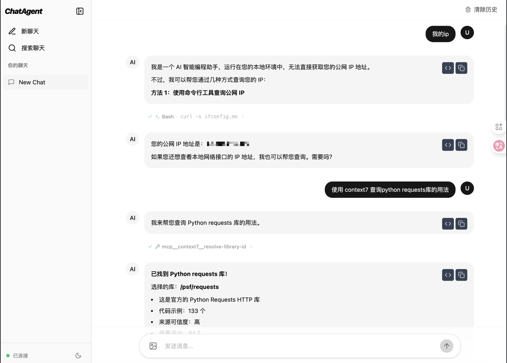

# ChatAgent

一个基于 [Claude Agent SDK](https://docs.anthropic.com/en/docs/agents-and-tools/claude-agent-sdk) 构建的全栈对话应用 Demo，展示如何使用 Anthropic 官方 Agent SDK 构建具有流式响应、工具调用和多模态能力的 AI 应用。

> **注意**：本项目是 Claude Agent SDK 的演示项目，旨在帮助开发者快速了解和上手 SDK 的核心功能。


## Demo


## ✨ 功能特性

- **🚀 流式响应** - 实时逐字显示 AI 回复，提供流畅的用户体验
- **🔧 工具调用** - 支持 Agent 调用外部工具完成复杂任务
- **🖼️ 多模态输入** - 支持文本和图片混合输入
- **💬 多轮对话** - 完整的上下文管理，支持连续对话
- **📁 会话管理** - 支持创建、切换、删除多个独立会话
- **⏹️ 中断生成** - 支持随时停止 AI 响应生成
- **📝 Markdown 渲染** - 支持代码高亮、数学公式 (KaTeX)、Mermaid 图表
- **💾 数据持久化** - SQLite 存储聊天记录，支持历史查看

## 技术架构

```
┌─────────────────┐     WebSocket      ┌─────────────────┐
│                 │ ◄────────────────► │                 │
│  React 前端     │                    │  FastAPI 后端   │
│  (TypeScript)   │     REST API       │  (Python)       │
│                 │ ◄────────────────► │                 │
└─────────────────┘                    └────────┬────────┘
                                                │
                                                ▼
                                       ┌─────────────────┐
                                       │ Claude Agent SDK│
                                       │   (Anthropic)   │
                                       └─────────────────┘
```

### 后端技术栈

- **Python 3.11+** + **FastAPI** - 异步 Web 框架
- **Claude Agent SDK** - Anthropic 官方 Agent SDK
- **SQLite** + **aiosqlite** - 异步数据持久化
- **uv** - 现代 Python 包管理器

### 前端技术栈

- **React 19** + **TypeScript** - 类型安全的前端框架
- **Vite 7** - 快速构建工具
- **Tailwind CSS 4** + **shadcn/ui** - 现代化 UI
- **react-markdown** - Markdown 渲染（支持 GFM、数学公式、代码高亮）
- **Mermaid** - 图表渲染

## 快速开始

### 环境要求

- Python 3.11+
- Node.js 18+
- pnpm
- uv
- Anthropic API Key

### 启动后端

```bash
cd backend
cp .env.example .env
# 编辑 .env 填入 ANTHROPIC_API_KEY

uv sync
uv run uvicorn main:app --reload --host 0.0.0.0 --port 3001
```

### 启动前端

```bash
cd frontend
pnpm install
pnpm dev
```

访问 http://localhost:5173 开始体验。

## 📁 项目结构

```
ChatAgent/
├── backend/                    # Python FastAPI 后端
│   ├── main.py                # 应用入口
│   ├── pyproject.toml         # Python 依赖配置
│   └── app/
│       ├── config.py          # 全局配置（系统提示词、工具列表等）
│       ├── core/
│       │   ├── agent_session.py    # Claude Agent SDK 会话管理
│       │   └── session_manager.py  # WebSocket 会话和消息广播
│       ├── api/
│       │   ├── routes.py      # REST API 路由
│       │   └── websocket.py   # WebSocket 端点
│       └── services/
│           └── chat_store.py  # SQLite 数据库 CRUD
│
└── frontend/                   # React TypeScript 前端
    ├── package.json           # Node.js 依赖配置
    └── src/
        ├── components/
        │   ├── chat/          # ChatContainer, ChatMessage, ChatInput
        │   └── sidebar/       # ChatSidebar
        ├── hooks/
        │   ├── useChat.ts     # WebSocket 管理和消息处理
        │   └── useChatList.ts # 聊天列表管理
        └── services/
            └── api.ts         # REST API 调用
```

## 🔌 WebSocket 消息协议

**客户端 → 服务器**：
| 类型 | 说明 | 示例 |
|------|------|------|
| `subscribe` | 订阅聊天 | `{ type: "subscribe", chat_id }` |
| `chat` | 发送消息 | `{ type: "chat", chat_id, content, images? }` |
| `stop` | 停止生成 | `{ type: "stop", chat_id }` |

**服务器 → 客户端**：
| 类型 | 说明 |
|------|------|
| `text_delta` | 流式文本增量 |
| `tool_use` / `tool_result` | 工具调用和结果 |
| `stream_start` / `stream_end` | 流式响应边界 |
| `history` / `tool_history` | 历史消息和工具调用 |

## ⚙️ 配置说明

### Agent 配置

后端配置位于 `backend/app/config.py`：

```python
SYSTEM_PROMPT = "..."      # Claude 系统提示词
ALLOWED_TOOLS = [...]      # 允许的工具列表
MAX_TURNS = 100            # 最大对话轮数
```

### MCP 服务器配置

MCP (Model Context Protocol) 服务器配置位于 `backend/data/mcp_servers.json`（参考 `backend/data/mcp_servers.example.json`）。支持 stdio 和 HTTP 两种类型：

```json
{
  "mcpServers": {
    "server_name": {
      "type": "stdio",
      "command": "npx",
      "args": ["-y", "@modelcontextprotocol/server-xxx"],
      "env": {},
      "allowedTools": ["tool1", "tool2"]
    },
    "http_server": {
      "type": "http",
      "url": "https://example.com/mcp",
      "headers": {
        "API_KEY": "your-api-key"
      },
      "allowedTools": ["tool1", "tool2"]
    }
  }
}
```

**配置字段说明**：

| 字段 | 类型 | 说明 |
|------|------|------|
| `type` | string | 服务器类型：`stdio` 或 `http` |
| `command` | string | stdio 类型的启动命令 |
| `args` | array | stdio 类型的命令参数 |
| `env` | object | 环境变量（可选） |
| `url` | string | http 类型的服务器 URL |
| `headers` | object | http 类型的请求头（可选） |
| `allowedTools` | array | 允许调用的工具列表 |

**常用 MCP 服务器示例**：

```json
{
  "mcpServers": {
    "filesystem": {
      "type": "stdio",
      "command": "npx",
      "args": ["-y", "@modelcontextprotocol/server-filesystem", "/path/to/allowed/dir"],
      "allowedTools": ["read_file", "write_file", "list_directory"]
    },
    "context7": {
      "type": "http",
      "url": "https://mcp.context7.com/mcp",
      "headers": {
        "CONTEXT7_API_KEY": "your-api-key"
      },
      "allowedTools": ["resolve-library-id", "get-library-docs"]
    }
  }
}
```

## 相关资源

- [Claude Agent SDK 官方文档](https://docs.anthropic.com/en/docs/agents-and-tools/claude-agent-sdk)
- [Anthropic API 文档](https://docs.anthropic.com/)

## License

MIT
